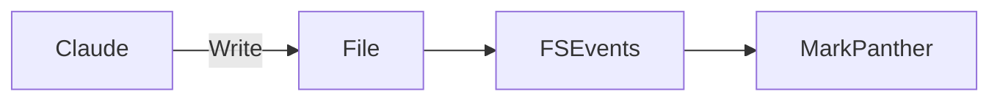
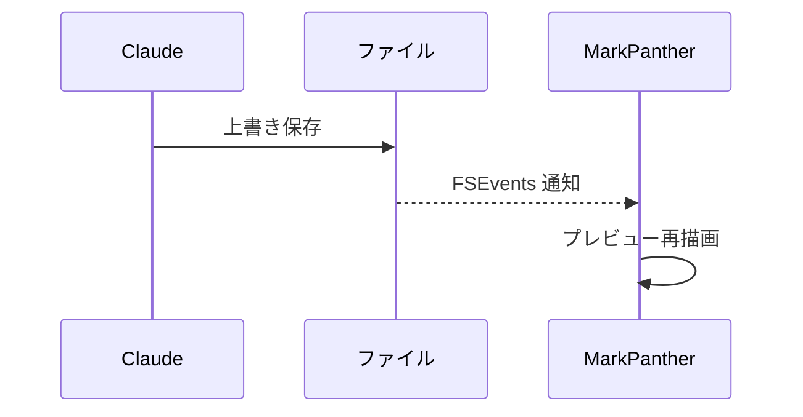

# MarkPanther 開発用サンプル

[TOC]

## 見出しと段落

これは **MarkPanther** の Web プレビュー（`preview.js`）を手元のブラウザで確認するためのサンプルです。日本語の段落もこの通り普通に表示されます。

同じ見出しテキストの重複テスト。

## 見出しと段落

## 表

| 項目 | 説明 | 対応 |
| --- | --- | --- |
| frontmatter | YAML を表にする | ✅ |
| TOC | `[TOC]` トークン | ✅ |
| 日本語 | 表の中でも問題ないか | ✅ |

## タスクリスト

- [x] vendor スクリプトを揃える
- [ ] Swift 側と結合する
- [ ] 実機で確認する

## 装飾

`==mark==` は ==ハイライト== になり、`~~strike~~` は ~~取り消し線~~ になります。上付き文字は H~2~O のように書けます（`superscript` オプションが必要）。x^2^ もどうぞ。

## コードブロック（言語あり／なし）

```js
function add(a, b) {
  // 行番号とハイライトの両方を確認する
  return a + b;
}
```

```
言語指定なしのブロックは自動判定せずプレーンに表示されるはず。
const should not = "be highlighted";
```

## Mermaid（2種類）





## KaTeX（inline / block）

インラインの数式 $E = mc^2$ はこのように表示され、ブロックの数式は次の通りです。

$$
\int_0^\infty e^{-x^2}\,dx = \frac{\sqrt{\pi}}{2}
$$

## 脚注

これは脚注付きの文章です。[^note]

[^note]: これが脚注の中身です。

## 相対画像


日本語と空白を含むファイル名（`<>` で囲む書き方）:


存在しない画像（壊れた画像の表示確認用）:


## 生 HTML と XSS 耐性

生の HTML も通ります: <strong>これは太字</strong>、<span style="color:red">これは赤字</span>。

以下は sanitize されて消えるはずのスクリプトです:

<script>alert('xss')</script>


## 引用

> これは引用です。
> 複数行にまたがることもあります。

---

以上でサンプル終わりです。
